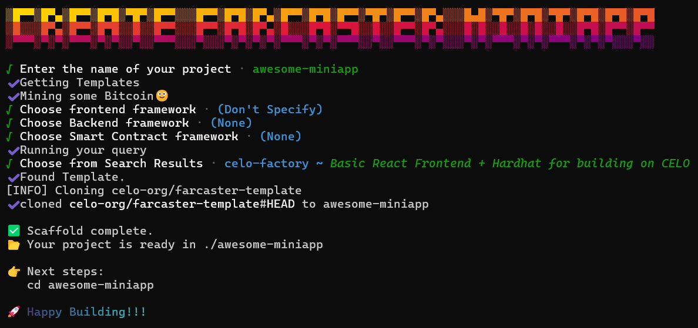

# create-farcaster-miniapp

A community-driven CLI to scaffold Farcaster MiniApps with frontend, backend, and smart contract templates.

Just like `npm create vite@latest`, this tool allows you to spin up a fully structured Farcaster MiniApp project by selecting a template or combining frameworks from a categorized registry.



---

## 📦 Installation

Use via `npx` (recommended):

```bash
npx create-farcaster-miniapp@latest
```

Or install globally:

```bash
npm install -g create-farcaster-miniapp
```

---

## 🧪 Usage

```bash
create-farcaster-miniapp [options]
```

### Available Options

```
--template <name>       Download and use a specific template
--frontend <name>       Specify frontend framework
--backend <name>        Specify backend framework
--smart-contract <name>  Specify smart contract template
--help, -h              Show help
```

### Examples

```bash
# Interactive mode (recommended for new users)
npx create-farcaster-miniapp

# Use a known template directly
npx create-farcaster-miniapp --template riff-factory

# Search and Select templates
npx create-farcaster-miniapp --template

# Manual selection by stack
npx create-farcaster-miniapp --frontend react --smart-contract hardhat
```

## 🧩 Contributing a Template

We encourage the community to add their own MiniApp templates!

### Steps to Contribute

1. **Fork this repository**
2. **Add your template entry** to the `templates` array in `template.json` in the root:

```json
{
  "name": "celo-factory",
  "description": "Basic Frontend + Hardhat for building on CELO",
  "repository": "https://github.com/celo-org/farcaster-template",
  "stack": {
    "frontend": ["react"],
    "backend": null,
    "smartContract": ["hardhat", "solidity"]
  }
}
```

3. **Ensure your repo contains**:

   - A `README.md` with usage/setup instructions
   - Actual starter code for building miniapps on farcaster

4. **Open a pull request** to this repository. The maintainers will review your PR for:

   - Metadata completeness
   - Functional structure
   - Category match

---

## 🧠 Template Stack Metadata

Each template defines its stack via a `stack` object, so users can search and filter intelligently:

```json
"stack": {
  "frontend": ["react"],
  "backend": null,
  "smartContract": ["hardhat", "solidity"]
}
```

Use `null` where applicable.

The CLI uses these fields to filter templates based on user input and enable stack compatibility matching.

---

## 💬 Community & Support

- Submit issues and feature requests in the [GitHub Issues](https://github.com/emmo00/create-farcaster-miniapp/issues)
- Open PRs for your own MiniApp templates!!

---

## 🪪 License

MIT
